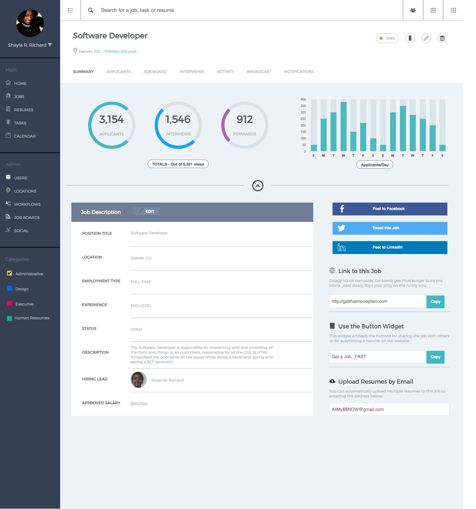

# Static-Comp-Challenge-3
This comp is a replica of an HR dashboard containing graphs and charts, icons and navigation bars containing a great deal of hopeful information for a user. I was able to get a few media queries in this iteration, and add ARIA roles.This comp was also very style heavy with the usage of icons and several css lines. I do appreciate the exercise also in using shortcuts and will implement the usage of idiomatic css going forward.
Below is an example of the original comp

Below is my rendition

